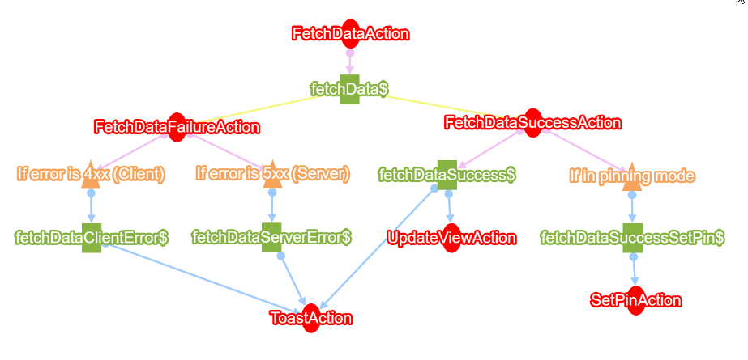

# redux-viewer
A simple CLI tool to view the graph of events and actions



## Usage
Install the package globally:
```
npm i -g redux-viewer
```

Document every effect you have with the following format:

| Property      | Status    | Description                                                                                           |
|---------------|-----------|-------------------------------------------------------------------------------------------------------|
| @type         | mandatory | Effect                                                                                                |
| @name         | mandatory | Effect's name                                                                                         |
| @ofType       | mandatory | What actions trigger the effect, comma seperated                                                      |
| @dependencies | optional  | What stores is this effect using, comma seperated                                                     |
| @filter       | optional  | Human readable filter that guards the effect                                                          |
| @action       | optional  | What actions does this effect trigger, comma separated. If an action is optional, use `?` in the end  |

A full example:
```ts
/**
 * @type Effect
 * @name someEffectName$
 * @ofType someAction, aDifferentAction
 * @dependencies feed, friends
 * @filter If something exists
 * @action callAction, anotherCallAction, maybeCallAction?
 */
```

Run the following command on your project:
```bash
rv -s src/
```

## Contributing:
fork repository and then:

```bash
npm link
npm start
```
This will start viewer session pointing to example folder